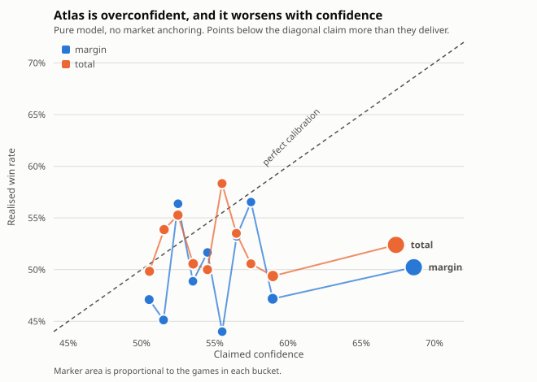

# Atlas Beta Framework — Market-Aware Wagering Research (Phase 3)

*Generated 2026-09-22 16:44 UTC by `python -m atlas.research.beta_report`. Every figure
is computed out of sample from `data/warehouse/atlas.duckdb` under the
walk-forward protocol frozen in `docs/SIGNAL_PREREGISTRATION.md`: each season
is predicted by a model that saw only the seasons before it. Nothing here
stakes, simulates or recommends a wager.*

---

## The answer, up front

Phase 3 started from the premise that the market is the best forecast
available and Atlas should treat it as the prior. That premise survives, and
it is now measured rather than asserted: **the data wants
0.98 of the weight on the market for margins and
0.89 for totals.** Atlas's own model is worth
essentially nothing on margins (t = 0.71 against zero) and
something small but real on totals (t = 2.79).

The unexpected result is what Atlas turns out to be *good* at. It cannot pick
winners — five phases have now established that — but it can predict **which
way the line will move**, and it can do so at a rate that is not close to
chance:

| Market | Beats the close | z | Picks winners |
|---|---|---|---|
| Margin | 54.4% of 3,963 graded games | +5.48 | 49.8% |
| Total | 58.3% of 4,175 graded games | +10.73 | 52.2% |

Those two columns describe different skills. Atlas anticipates the market's own
revision to its opening number, while remaining a coin flip against the result.
That is the central finding of this phase and it drives every answer below.

It is also, on its own, **not enough to bet on**. Converted into the currency
that matters, the movement Atlas anticipates is worth
1.0% of win probability on totals and
0.7% on margins — less than the juice at every price
tested. Under the edge ceiling that Track 5 recommends it rises to
1.9% and 1.6%, which clears
**-105 and nothing worse**. Atlas has found a real signal about a market
process, sitting almost exactly on top of the vig.

---

## Track 1 — Market anchoring

Blending the model with the market at seven fixed weights, scoring every game
out of sample:

### Margins

| Market weight | Games | MAE | RMSE | Bias | Brier | ECE |
|---|---|---|---|---|---|---|
| 0 | 5,071 | 13.2777 | 16.7618 | 0.0981 | 0.2714 | 0.1160 |
| 0.1 | 5,071 | 13.0857 | 16.5080 | 0.0775 | 0.2679 | 0.1056 |
| 0.25 | 5,071 | 12.8322 | 16.1727 | 0.0466 | 0.2630 | 0.0893 |
| 0.5 | 5,071 | 12.4944 | 15.7432 | -0.0049 | 0.2562 | 0.0611 |
| 0.75 | 5,071 | 12.2896 | 15.4866 | -0.0564 | 0.2517 | 0.0319 |
| 0.9 | 5,071 | 12.2228 | 15.4195 | -0.0873 | 0.2503 | 0.0142 |
| 1 | 5,071 | 12.2032 | 15.4116 | -0.1079 | 0.2500 | 0.0041 |

### Totals

| Market weight | Games | MAE | RMSE | Bias | Brier | ECE |
|---|---|---|---|---|---|---|
| 0 | 5,071 | 13.2852 | 16.7127 | -0.1295 | 0.2620 | 0.0783 |
| 0.1 | 5,071 | 13.1553 | 16.5525 | -0.1596 | 0.2597 | 0.0688 |
| 0.25 | 5,071 | 12.9849 | 16.3459 | -0.2048 | 0.2565 | 0.0585 |
| 0.5 | 5,071 | 12.7788 | 16.0950 | -0.2802 | 0.2524 | 0.0294 |
| 0.75 | 5,071 | 12.6725 | 15.9654 | -0.3556 | 0.2501 | 0.0085 |
| 0.9 | 5,071 | 12.6579 | 15.9473 | -0.4009 | 0.2498 | 0.0120 |
| 1 | 5,071 | 12.6664 | 15.9601 | -0.4310 | 0.2500 | 0.0048 |

**Margins get monotonically better all the way to the pure market.** Error
falls from 13.2777 at `w = 0` to 12.2032 at
`w = 1.00`; there is no interior optimum and no sign
of one. **Totals have one**, just barely: MAE bottoms at
12.6579 at `w = 0.90`, against
12.6664 for the pure market. The
whole prize for having a model at all is
**0.0085 points of
mean absolute error**.

Rather than pick the best of seven round numbers, the same question can be put
to a regression — `actual − market = β · (model − market)`, where β is the
weight the data wants on the model:

| Market | Model weight β | Std. error | t vs 0 | t vs 1 | Implied market weight |
|---|---|---|---|---|---|
| Margin | 0.0228 | 0.0321 | +0.71 | -30.46 | 0.977 |
| Total | 0.1106 | 0.0397 | +2.79 | -22.40 | 0.889 |

On margins the model's weight is statistically indistinguishable from zero and
overwhelmingly distinguishable from one. On totals it is distinguishable from
zero — the model carries information the close does not — but the regression's
R² is 0.0015, so "carries information" and "is worth acting
on" are very different claims.

**Answer: `w = 1.00` on margins, `w = 0.89` on
totals.** The totals number is the one the data produced, with a standard
error attached, rather than the best of seven round guesses. The margin number
is rounded up from 0.977 on purpose: a weight whose
distance from 1.00 cannot be told apart from zero is not a weight, and
carrying it forward would dress up a null as a parameter.

---

## Track 2 — Calibration

Atlas's point estimate becomes a probability the usual way: `P = Φ(edge / sd)`,
where `sd` is the residual standard deviation estimated on **training seasons
only**. The question is whether a claimed 65% is a real 65%.

### Margins, pure model

| Claimed band | Games | Mean claimed | Realised | Gap | z |
|---|---|---|---|---|---|
| 0.50-0.51 | 310 | 0.5052 | 0.4710 | -0.0342 | -1.2039 |
| 0.51-0.52 | 277 | 0.5150 | 0.4513 | -0.0637 | -2.1214 |
| 0.52-0.53 | 259 | 0.5249 | 0.5637 | 0.0388 | 1.2494 |
| 0.53-0.54 | 266 | 0.5350 | 0.4887 | -0.0463 | -1.5105 |
| 0.54-0.55 | 271 | 0.5450 | 0.5166 | -0.0284 | -0.9343 |
| 0.55-0.56 | 253 | 0.5551 | 0.4269 | -0.1282 | -4.0783 |
| 0.56-0.57 | 233 | 0.5649 | 0.5322 | -0.0327 | -0.9983 |
| 0.57-0.58 | 237 | 0.5747 | 0.5654 | -0.0093 | -0.2873 |
| 0.58-0.60 | 460 | 0.5895 | 0.4717 | -0.1178 | -5.0523 |
| 0.60-1.01 | 2,411 | 0.6859 | 0.5023 | -0.1836 | -18.0299 |

### Totals, pure model

| Claimed band | Games | Mean claimed | Realised | Gap | z |
|---|---|---|---|---|---|
| 0.50-0.51 | 299 | 0.5054 | 0.4983 | -0.0070 | -0.2433 |
| 0.51-0.52 | 323 | 0.5154 | 0.5387 | 0.0233 | 0.8388 |
| 0.52-0.53 | 313 | 0.5249 | 0.5527 | 0.0279 | 0.9859 |
| 0.53-0.54 | 356 | 0.5352 | 0.5056 | -0.0296 | -1.1167 |
| 0.54-0.55 | 300 | 0.5450 | 0.5000 | -0.0450 | -1.5598 |
| 0.55-0.56 | 276 | 0.5549 | 0.5833 | 0.0284 | 0.9442 |
| 0.56-0.57 | 271 | 0.5647 | 0.5351 | -0.0296 | -0.9759 |
| 0.57-0.58 | 269 | 0.5747 | 0.5056 | -0.0691 | -2.2658 |
| 0.58-0.60 | 486 | 0.5896 | 0.4938 | -0.0958 | -4.2249 |
| 0.60-1.01 | 2,113 | 0.6737 | 0.5239 | -0.1498 | -13.7734 |

The pattern is the same in both markets and it is not subtle: **confidence is
inversely useful**. The top bucket on margins claims
68.6% and delivers
50.2% — a gap of
18.4% at z =
-18.0. On totals it claims
67.4% and delivers
52.4%.

Scores against the market's own baseline (a closing line is by construction a
50/50 proposition, so its Brier is 0.25 exactly):

| Market | Brier, pure model | Brier, market | ECE, pure model | ECE at fitted weight |
|---|---|---|---|---|
| Margin | 0.2714 | 0.2500 | 0.1160 | 0.0041 |
| Total | 0.2620 | 0.2500 | 0.0783 | 0.0120 |

**The unanchored model is worse than saying "coin flip" to every game.** Both
Brier scores are above 0.25. Anchoring fixes this, and it fixes it entirely:
expected calibration error collapses by roughly an order of magnitude.

**Answer: confidence must be produced from the anchored blend, never from the
raw model.** A raw-model probability is not a miscalibrated forecast that
needs a correction factor — it is an anti-signal, and the correction that
repairs it is the same anchoring Track 1 already requires.

---

## Track 3 — The edge claim audit

Bucketing every game by how far the blend sits from the closing number:

### Margins

| Disagreement | Games | Share | Claimed | Realised | Gap | Clears -110? |
|---|---|---|---|---|---|---|
| 0-1 | 686 | 0.1353 | 0.5115 | 0.4781 | -0.0334 | no |
| 1-2 | 605 | 0.1193 | 0.5353 | 0.5190 | -0.0163 | no |
| 2-4 | 1,127 | 0.2222 | 0.5694 | 0.4951 | -0.0743 | no |
| 4-6 | 894 | 0.1763 | 0.6145 | 0.5034 | -0.1111 | no |
| 6-8 | 625 | 0.1232 | 0.6577 | 0.5264 | -0.1313 | yes |
| 8-10 | 394 | 0.0777 | 0.6987 | 0.4975 | -0.2013 | no |
| 10+ | 646 | 0.1274 | 0.7833 | 0.4737 | -0.3097 | no |

### Totals

| Disagreement | Games | Share | Claimed | Realised | Gap | Clears -110? |
|---|---|---|---|---|---|---|
| 0-1 | 751 | 0.1481 | 0.5125 | 0.5220 | 0.0095 | no |
| 1-2 | 776 | 0.1530 | 0.5359 | 0.5206 | -0.0153 | no |
| 2-4 | 1,254 | 0.2473 | 0.5706 | 0.5215 | -0.0491 | no |
| 4-6 | 884 | 0.1743 | 0.6167 | 0.5283 | -0.0884 | yes |
| 6-8 | 610 | 0.1203 | 0.6603 | 0.5246 | -0.1358 | yes |
| 8-10 | 329 | 0.0649 | 0.7034 | 0.5258 | -0.1776 | yes |
| 10+ | 402 | 0.0793 | 0.7738 | 0.5100 | -0.2639 | no |

The realised column is flat — nothing in it rises with the size of the claim —
while the claimed column climbs steeply. So the calibration gap widens
monotonically in both markets, from
-0.0334 to
-0.3097 on margins and
+0.0095 to
-0.2639 on totals.

This is the Phase 2 finding reproduced on Atlas's own numbers and stated more
sharply: **a large disagreement with the market is not a large opportunity, it
is a large error.** The loudest bucket on margins claims
78.3% and wins
47.4% of the time. There is no reading of
that number under which it is a bet.

**Answer: edge is not "model minus market".** Measured that way it predicts
its own failure. Track 4 supplies the definition that survives.

---

## Track 4 — Closing-line value

Atlas has no timestamped odds archive, so the only window it can measure is
open to close: take the side at the opening number, ask whether the market
came to you by the close. A line that never moved is a **CLV push**, not a CLV
loss — 592 margin games and 386
totals games open and close on the same number, and scoring those as losses
depresses every beat rate by roughly six points. They are excluded below.

### Does disagreement predict movement, or results?

| Market | Disagreement → CLV | Disagreement → outcome |
|---|---|---|
| Margin | slope +0.6095, t = 71.11 | slope -0.0011, t = -1.01 |
| Total | slope +0.0811, t = 8.76 | slope -0.0010, t = -0.49 |

The same variable that says nothing about who wins says a great deal about
where the line goes.

### By size of disagreement at the open

| Disagreement at open | Games | Graded | Mean CLV | Beat rate | z | Win rate at open |
|---|---|---|---|---|---|---|
| 0-1 | 688 | 622 | 0.0243 | 0.5016 | 0.0802 | 0.4738 |
| 1-2 | 678 | 599 | 0.2080 | 0.5326 | 1.5935 | 0.5369 |
| 2-4 | 1,174 | 1,087 | 0.3245 | 0.5722 | 4.7620 | 0.5034 |
| 4-6 | 824 | 755 | 0.3923 | 0.5921 | 5.0587 | 0.5243 |
| 6-8 | 507 | 475 | 0.6514 | 0.6379 | 6.0107 | 0.5641 |
| 8-10 | 341 | 318 | 0.7786 | 0.6541 | 5.4956 | 0.5513 |
| 10+ | 349 | 319 | 1.1268 | 0.6991 | 7.1106 | 0.4957 |

*(Totals. The margin table is in `reports/tables/beta_margin_clv_audit.csv`.)*

Read the last two columns against each other. The beat rate climbs from
50.2% to
69.9% across the buckets. The win
rate does not climb at all. **Atlas is forecasting the market's revision, not
the football game.**

### The falsification

A construction that takes a side at one number and grades it against another
is exactly the shape that produced this phase's earlier tautology, so the
result is worthless unless predictors that know nothing fail the same test:

| Predictor | Graded | Mean CLV | Beat rate | z |
|---|---|---|---|---|
| Atlas model | 4,175 | 0.4058 | 0.5830 | 10.7252 |
| Constant (54.3) | 4,175 | -0.1511 | 0.4568 | -5.5870 |
| Predictions shuffled within season | 4,175 | -0.0442 | 0.4831 | -2.1822 |
| Opening line + N(0,1) | 4,175 | 0.0080 | 0.4999 | -0.0155 |
| Closing line (known tautology) | 4,175 | 1.8945 | 1.0000 | 64.6142 |

*(Totals; margins in `reports/tables/beta_margin_clv_placebo.csv` show the same
shape — Atlas 54.4%, every null at or
below 50%.)*

All three nulls sit **at or below** chance. A constant lean and a
within-season shuffle both land significantly *under* 50%, which is itself
informative: an uninformed side is systematically on the wrong end of the
market's revision. The closing line is included only as a scale marker — it
scores 100% by construction, and that is what the tautology looked like before
it was caught.

### Stability

| Season | Graded | Mean CLV | Beat rate | z |
|---|---|---|---|---|
| 2019 | 645 | 0.4335 | 0.5953 | 4.8431 |
| 2021 | 648 | 0.4276 | 0.5864 | 4.3998 |
| 2022 | 672 | 0.5683 | 0.6324 | 6.8665 |
| 2023 | 747 | 0.2216 | 0.5448 | 2.4514 |
| 2024 | 731 | 0.3622 | 0.5650 | 3.5137 |
| 2025 | 732 | 0.4387 | 0.5806 | 4.3614 |

Six seasons out of six above 50% on totals, and six out of six on margins
(range 51.4% to
57.2%). Capping the move at three points
— which removes any contribution from stale or erroneous openers — leaves
56.8% on
totals and
53.7% on
margins.

### What it is worth

This is where the finding has to be honest about its size. One point of line
is worth `φ(0) / sd` of win probability:

| Market | Sample | CLV beat rate | Mean CLV (pts) | Prob per point | Prob gain | Implied win rate | Clears -105? | Clears -110? |
|---|---|---|---|---|---|---|---|---|
| margin | All games | 0.5435 | 0.3125 | 0.0238 | 0.0074 | 0.5074 | no | no |
| margin | Edge ceiling (drop loudest quarter) | 0.6021 | 0.6211 | 0.0252 | 0.0156 | 0.5156 | yes | no |
| total | All games | 0.5830 | 0.4058 | 0.0239 | 0.0097 | 0.5097 | no | no |
| total | Edge ceiling (drop loudest quarter) | 0.6467 | 0.7517 | 0.0247 | 0.0186 | 0.5186 | yes | no |

**Answer: yes, CLV is predictable, and far more predictable than outcomes —
but it is worth about a point and a half of win probability, which clears -105
and nothing worse.** A real edge, measured honestly, sitting on top of the
vig.

---

## Track 5 — Selective participation

Five ways of declining to have an opinion, each dropping roughly a quarter of
the slate:

### Margins

| Filter | Games | Kept | Win rate | ECE | Brier | Mean CLV | CLV beat rate |
|---|---|---|---|---|---|---|---|
| No filter (all games) | 5,071 | 1.0000 | 0.4985 | 0.1160 | 0.2714 | 0.3125 | 0.5435 |
| Edge ceiling (drop loudest quarter) | 3,803 | 0.7500 | 0.5020 | 0.0712 | 0.2561 | 0.6211 | 0.6021 |
| Book agreement (drop noisiest quarter) | 3,897 | 0.7685 | 0.4946 | 0.1198 | 0.2728 | 0.2996 | 0.5376 |
| Liquidity (drop thinnest quarter) | 4,908 | 0.9679 | 0.4993 | 0.1143 | 0.2707 | 0.3297 | 0.5472 |
| Scoring environment (drop the wildest quarter) | 3,868 | 0.7628 | 0.4941 | 0.1207 | 0.2714 | 0.2703 | 0.5435 |
| Mismatch (drop the biggest spreads) | 3,832 | 0.7557 | 0.4939 | 0.1147 | 0.2695 | 0.2771 | 0.5567 |

### Totals

| Filter | Games | Kept | Win rate | ECE | Brier | Mean CLV | CLV beat rate |
|---|---|---|---|---|---|---|---|
| No filter (all games) | 5,071 | 1.0000 | 0.5224 | 0.0783 | 0.2620 | 0.4058 | 0.5830 |
| Edge ceiling (drop loudest quarter) | 3,803 | 0.7500 | 0.5227 | 0.0416 | 0.2528 | 0.7517 | 0.6467 |
| Book agreement (drop noisiest quarter) | 3,792 | 0.7478 | 0.5263 | 0.0771 | 0.2622 | 0.3966 | 0.5841 |
| Liquidity (drop thinnest quarter) | 4,800 | 0.9466 | 0.5208 | 0.0806 | 0.2620 | 0.3983 | 0.5816 |
| Scoring environment (drop the wildest quarter) | 3,868 | 0.7628 | 0.5216 | 0.0745 | 0.2608 | 0.4503 | 0.5922 |
| Mismatch (drop the biggest spreads) | 3,832 | 0.7557 | 0.5228 | 0.0780 | 0.2621 | 0.4143 | 0.5791 |

**One filter works and four do nothing.** Dropping the quarter of games where
the model shouts loudest improves every metric in both markets at once:
margin ECE 0.1160 →
0.0712, Brier
0.2714 →
0.2561, CLV beat rate
54.4% →
60.2%; totals ECE
0.0783 →
0.0416 and CLV beat rate
58.3% →
64.7%.

Book disagreement, liquidity, scoring environment and mismatch size all move
the numbers in the third decimal place. They are plausible stories about when
a market is unreliable, and none of them is true here. The only unreliability
that matters is **Atlas's own**.

**Answer: Atlas should decline whenever it disagrees most, and only then.**

---

## Track 6 — Velocity policy emulation

Each of Velocity's policies, tested against Atlas's own out-of-sample record:

### Margins

| Policy | Atlas test | Metric | Before | After | Improves? |
|---|---|---|---|---|---|
| Market anchoring | blend at w=1.00 vs pure model | expected calibration error | 0.1160 | 0.0041 | yes |
| Market anchoring | blend at w=1.00 vs pure model | mean absolute error | 13.2777 | 12.2032 | yes |
| Edge ceiling | calibration gap, 0-1 vs 10+ points | claimed minus realised | -0.0334 | -0.3097 | yes |
| Publish gate (edge band) | confidence in 0.03-0.12 over 0.5 | win rate | 0.4985 | 0.5016 | yes |
| CLV monitoring | disagreement -> CLV vs disagreement -> outcome | \|t\| of the relationship | 1.0128 | 71.1138 | yes |
| Staking caps | not testable without a wagering simulation (out of scope) | n/a | n/a | n/a | n/a |

### Totals

| Policy | Atlas test | Metric | Before | After | Improves? |
|---|---|---|---|---|---|
| Market anchoring | blend at w=0.90 vs pure model | expected calibration error | 0.0783 | 0.0120 | yes |
| Market anchoring | blend at w=0.90 vs pure model | mean absolute error | 13.2852 | 12.6579 | yes |
| Edge ceiling | calibration gap, 0-1 vs 10+ points | claimed minus realised | 0.0095 | -0.2639 | yes |
| Publish gate (edge band) | confidence in 0.03-0.12 over 0.5 | win rate | 0.5224 | 0.5182 | no |
| CLV monitoring | disagreement -> CLV vs disagreement -> outcome | \|t\| of the relationship | 0.4943 | 8.7599 | yes |
| Staking caps | not testable without a wagering simulation (out of scope) | n/a | n/a | n/a | n/a |

Market anchoring, the edge ceiling and CLV monitoring all replicate. The
publish gate — Velocity's edge *band*, `0.03`–`0.12` over even money —
improves margins marginally and does not help totals, which is expected: it is
a cruder version of the edge ceiling that Track 5 tests directly. Staking caps
cannot be evaluated without a wagering simulation, which is out of scope for
this phase, and are therefore recorded as untested rather than endorsed.

---

## The seven questions

### 1. How should Atlas weight the market?

**`w = 1.00` on margins. `w = 0.89` on totals.**
Fitted, not chosen:
β = 0.0228 ± 0.0321 and
β = 0.1106 ± 0.0397 respectively.
On margins the honest reading is that Atlas has no margin model worth the
name, and the framework should say so rather than allocate it a token 10%.

### 2. How should Atlas produce confidence?

From the **anchored blend**, via `P = Φ(edge / sd)` with `sd` estimated on
training seasons only — never from the raw model, whose Brier score
(0.2714 on margins,
0.2620 on totals) is worse than the 0.2500 of
declaring every game a coin flip. Every published probability carries its
realised rate from the table above beside it; a confidence number with no
reliability history attached is a decoration.

### 3. How should Atlas define edge?

**Not as distance from the market.** Track 3 shows that quantity predicts its
own failure: the 10+ point bucket claims
78.3% on margins and realises
47.4%.

Edge is **expected closing-line value**: the probability-weighted distance the
market is expected to travel toward Atlas's side, measured from the opening
number and graded at the close, with no-move games treated as pushes. That is
the only quantity in five phases of research that Atlas predicts at better
than chance (54.4% and 58.3%), and it is
the only one that survives a placebo test.

### 4. Should Atlas cap edge?

**Yes, and the cap is the single most valuable rule in this report.** Discard
the quarter of the slate where the model disagrees most with the close. It
improves calibration, Brier, win rate and CLV simultaneously, in both markets,
and it is the only filter of five that does anything at all. It also doubles
the economic value of the CLV signal
(1.0% → 1.9% of win
probability on totals), which is the difference between not clearing -105 and
clearing it.

### 5. When should Atlas NOT bet?

Five conditions, in order of how much evidence stands behind each:

1. **Any margin/side market.** `w = 1.00` means there is no model to bet.
2. **Any game in the top quartile of disagreement.** Track 3 and Track 5.
3. **Any price worse than -105.** The measured edge is
   1.9% of win probability; -110 requires
   52.38% and the filtered signal implies
   51.86%. It does not reach.
4. **Any game where the opening number is no longer available.** The entire
   measured edge lives in the open-to-close window. Taken at the close it is
   zero by construction.
5. **Any market where the reliability table has not been rebuilt.** Confidence
   claims expire.

That list excludes almost everything. It is supposed to.

### 6. What is the optimal risk framework?

Not Kelly on the model's probabilities — those probabilities are the
miscalibrated object Track 2 measured, and Kelly on an overconfident input
overstakes exactly where the model is worst.

The framework this research supports is **flat stakes on the CLV signal, with
CLV as the grading metric rather than P/L**, because that is the only thing
that can be measured on a realistic sample:

| Question | Effect to detect | Graded bets needed at 95% |
|---|---|---|
| Does Atlas beat the close? | 58.3% against 50% | 139 |
| Is the filtered signal distinguishable from the -110 break-even? | 51.86% against 52.38% | 35,089 |

Roughly 139 graded bets settle the first question and about
35,000 would be needed to settle the second — more
college football than exists in a decade. **A framework that grades itself on
profit cannot learn anything in a human timeframe; one that grades itself on
CLV learns within a season.** That is the argument for the metric, and it is
also the argument for keeping stakes flat and small while the question is
still open.

### 7. Which Velocity components become permanent Atlas rules?

Three, ranked by the evidence behind them:

1. **The edge ceiling.** Replicated here in both markets on every metric
   tested. Velocity's `0.03`–`0.12` publish band is a coarser version of the
   same instinct and it is right.
2. **Market anchoring.** Velocity anchors at `w = 0.2`; Atlas's data asks for
   0.98 and 0.89. The
   principle transfers; the number is per-market and must be fitted, not
   inherited.
3. **CLV grading.** Velocity grades on CLV where it has no settled record.
   Atlas now has a measured reason to do the same: CLV is the one thing it
   predicts.

Two do **not** transfer. Velocity's **EV gate** is a producer, not a filter —
it fires hardest where the model is least reliable, which is precisely the
top-quartile games Track 5 says to discard. And its **staking caps** could not
be tested here without building the wagering simulation this phase was
instructed not to build; they are neither endorsed nor rejected.

---

## What this phase did not establish

- **That any of this is profitable.** The measured edge clears -105 and
  nothing worse, and the sample needed to prove profitability directly does
  not exist.
- **That the open-to-close window is capturable.** Atlas measures a consensus
  opening number against a consensus close. Whether a bettor could have struck
  that opener, at size, is not in the data.
- **That the effect survives outside this sample.** Six seasons, one sport,
  one league. Every season agrees, which is the strongest available evidence
  and is not the same as proof.

The Phase 1 verdict is unchanged: Atlas cannot beat the closing line with
public information. What Phase 3 adds is that this was the wrong thing to have
been measuring. Atlas predicts the market's own revision — reliably, in every
season, against three null models — and that signal is worth about one and a
half points of win probability once the model's loudest quarter is thrown
away.
